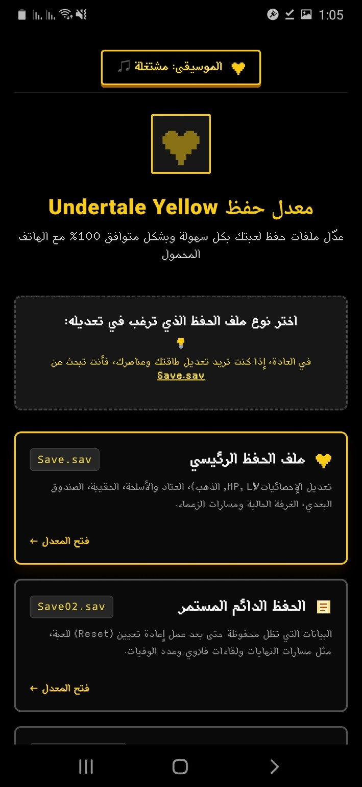
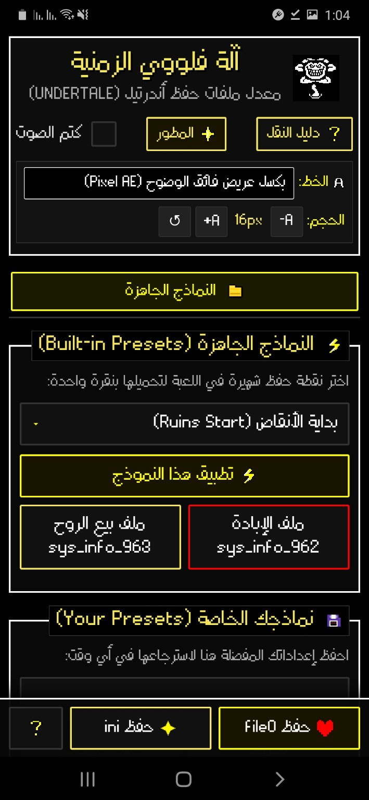
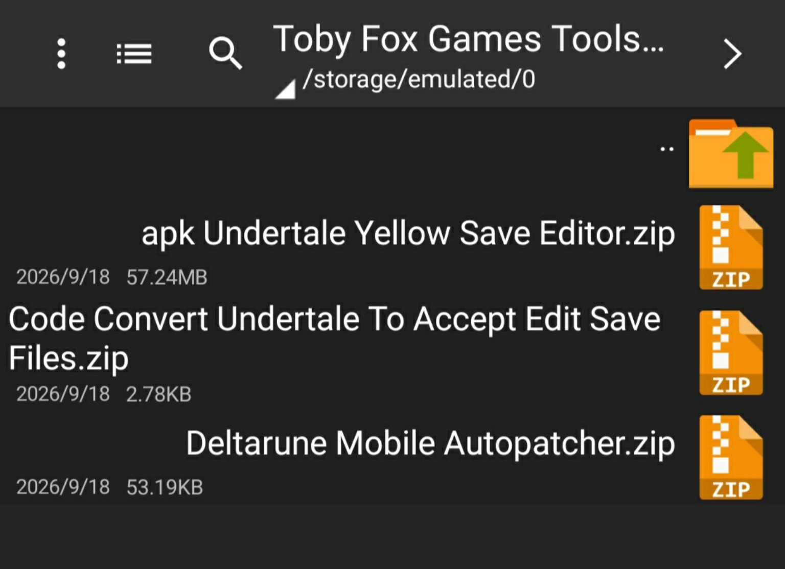

# 🎮 Toby Fox Games Tools for Arabic Users

مجموعة أدوات ومشاريع مفيدة لمستخدمي ألعاب **Toby Fox**، مع واجهات ومحتوى عربي قدر الإمكان.

> **ملاحظة:** هذا المستودع مجتمعي وغير رسمي، ولا يمثل Toby Fox أو أي جهة رسمية تابعة له.

---

## 📦 الأدوات

### 💛 Undertale Yellow Save Editor

محرر ملفات الحفظ الخاص بـ **Undertale Yellow**.

من الواجهة الظاهرة في الصور يمكن تعديل بيانات مثل:

- الإحصائيات
- HP
- مستوى اللاعب (LV)
- النقود
- العتاد والأسلحة
- الحقيبة
- الصندوق
- العنصر/المكان الحالي
- بعض بيانات الحالة ومسارات الزعماء

كما تظهر في الواجهة أنواع مختلفة من ملفات الحفظ مثل `Save.sav` و `Save02.sav`.



---

### 💾 أدوات ملفات الحفظ

يضم المشروع أيضًا أدوات وتجارب مرتبطة بملفات حفظ ألعاب Toby Fox، بهدف تسهيل التعامل معها على الهاتف والبيئات التي يستخدمها اللاعبون العرب.



---

## 📁 محتويات المستودع

```text
Toby_Fox_Games_Tools_for_Arabic_Users/
├── README.md
└── images/
    ├── undertale-yellow-save-editor.jpg
    ├── deltarune-save-editor.jpg
    └── tools-files.jpg
```

---

## 🛠️ ملفات ومشاريع مرتبطة

يمكن استخدام المستودع لتنظيم أدوات مثل:

- محررات ملفات الحفظ
- أدوات التعامل مع ملفات ألعاب Toby Fox
- أدوات التعديل المخصصة للهاتف
- مشاريع التعريب وواجهات المستخدم العربية
- أدوات مساعدة لمجتمع التعديل (Modding)



---

## 🌐 للمستخدمين العرب

الهدف من هذا المستودع هو جمع الأدوات والمعلومات المتعلقة بهذه المشاريع في مكان واحد، مع تقديم الواجهات والشروحات باللغة العربية عندما يكون ذلك ممكنًا.

**العربية أولًا 🇩🇿❤️**

---

## ⚠️ تنبيه

استخدم أدوات تعديل ملفات الحفظ مع نسخة احتياطية من ملفاتك الأصلية.

هذا المستودع لا يوزع ملفات ألعاب Toby Fox الأصلية ولا يدّعي ملكيتها.

---

## ❤️ المساهمة

إذا كان لديك:

- أداة مفيدة
- مشروع مفتوح المصدر
- ترجمة عربية
- إصلاح أو تحسين
- شرح لاستخدام إحدى الأدوات

يمكنك اقتراح إضافته إلى المستودع.

---

## 📜 الحقوق

حقوق الألعاب والبرامج والموارد الأصلية تعود إلى أصحابها ومطوريها.

المحتوى الموجود هنا مخصص لتجميع الأدوات والمشاريع المجتمعية وتسهيل الوصول إليها للمستخدمين العرب.
